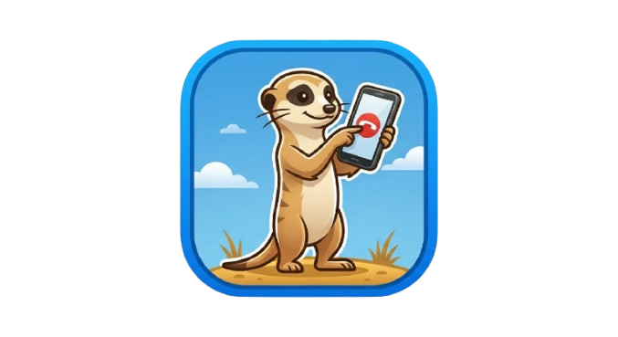

  

# 🛡️ Suricate : Votre Sentinelle Contre les Indésirables

Suricate est une application Android intelligente conçue pour protéger votre tranquillité. Contrairement aux bloqueurs classiques, Suricate agit comme une sentinelle : elle identifie, filtre et rejette les appels malveillants tout en préservant l'intégrité de votre journal d'appels.

J'ai créé Suricate pour rendre nos téléphones à nouveau silencieux face au démarchage abusif, tout en garantissant une application 100% respectueuse de votre vie privée.

## ✨ La Philosophie Suricate

La plupart des applications de blocage suppriment les appels sans vous prévenir. Suricate privilégie la transparence. Les appels détectés comme indésirables sont rejetés par le système pour ne pas vous déranger, mais ils **restent visibles** dans votre journal d'appels système et dans l'historique de l'application. Vous gardez ainsi le contrôle total et ne ratez aucune information.

## 🚀 Deux niveaux de protection

| Fonctionnalité | Standard (Gratuit) | Élite (Premium) |
| :--- | :---: | :---: |
| **Bouclier Anti-Démarchage** | 12 500 000 de numéros | **21 000 000 de numéros** |
| **Mises à jour** | Toutes les 3 semaines | ⚡ **Temps Réel (Push)** |
| **Protection SMS** (Phishing) | ❌ | ✅ |
| **Filtrage International** | ❌ | ✅ |
| **Mode "Cercle Restreint"** | ❌ | ✅ |
| **Base communautaire** | Standard | 🚀 **Prioritaire** |
| **Soutien au développement** | ❌ | ❤️ |

## 🔒 Sécurité & Transparence

Ce dépôt GitHub est la vitrine publique de l'application. Pour des raisons de sécurité et de protection de l'infrastructure, le code source de l'application est hébergé sur un environnement privé.

Ici, vous trouverez les documents essentiels :
*   ⚖️ Les Conditions Générales d'Utilisation
*   👤 La Politique de Confidentialité (Respect strict du RGPD)
*   📑 Les Mentions Légales

## 🛠️ Support & Amélioration

Vous utilisez Suricate et vous souhaitez nous aider à rendre le réseau plus sûr ? Ce dépôt est votre espace de communication.

**Un problème ? Une idée ?** Cliquez sur l'onglet **Issues** en haut de cette page pour :
*   💡 Proposer une **suggestion d'amélioration** pour l'offre Élite.
*   🛡️ Signaler une **erreur de filtrage** (Faux positif).
*   💬 Participer aux échanges sur le futur de l'application via les **Discussions**.

## ❤️ Soutenir le Projet

Suricate est une aventure indépendante et sans publicité. Si l'application vous aide au quotidien à retrouver votre sérénité face au démarchage, vous pouvez soutenir son développement et la maintenance de l'infrastructure par un don. Chaque geste, même modeste, contribue à garder le réseau plus propre pour tous.

---
**Suricate : Vigilance. Protection. Sérénité.**
